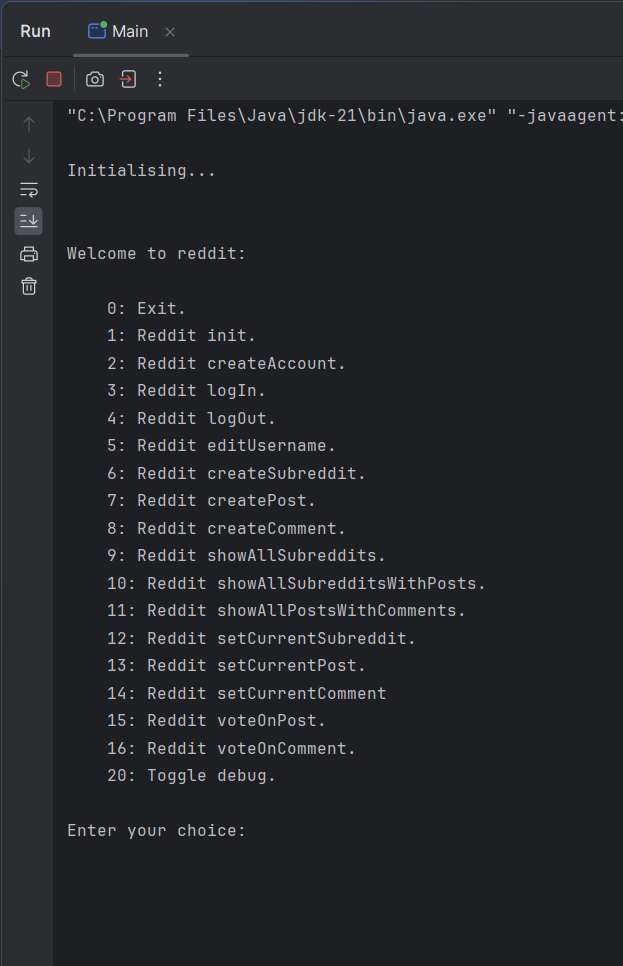
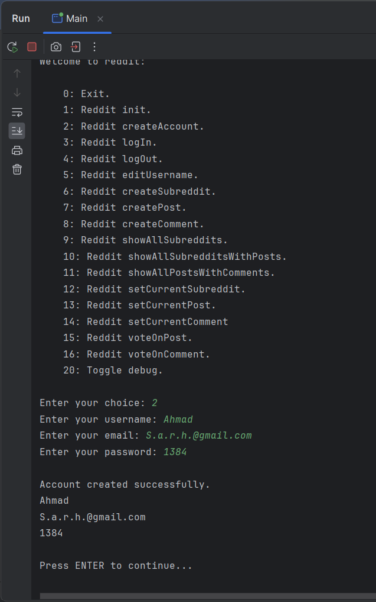
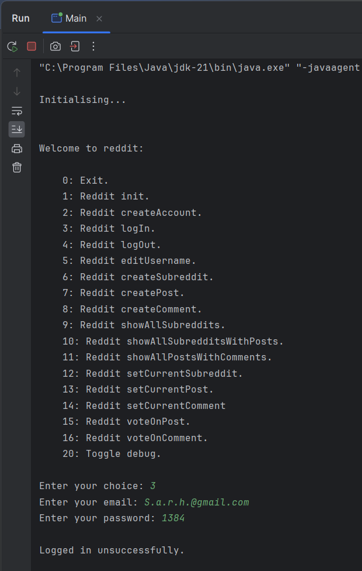

## Reddit Project Readme
This is a detailed GitHub README for the project.
It is in Markdown format.
### Project Title: Reddit in java by Ahmad reza Hosseiny
### Table of Contents:

### Description:
Provide an overview of what the project does and its
purpose.
### Usage:

### Demo/GIFs/Images:
Provide visuals to showcase the project in action.
Main run menu:

Main create account:

Main login:

### Credits:
Acknowledge and attribute any contributors, libraries,
dependencies, or resources used in the project.
### Changelog:
Document changes made in each version of the project.
### Contact Information:
Offer ways for users to reach out for help or
support.